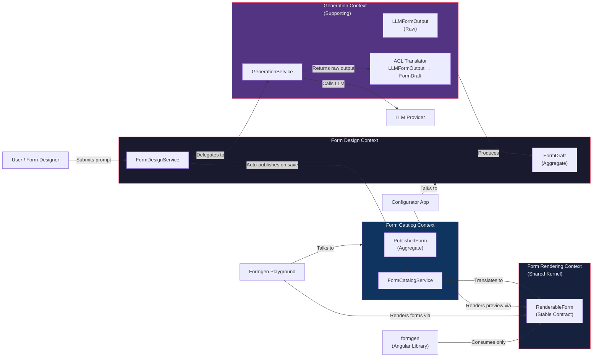
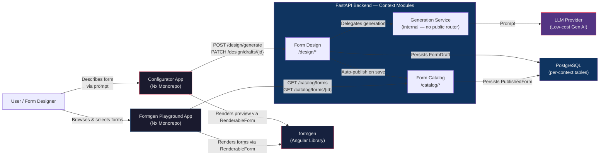
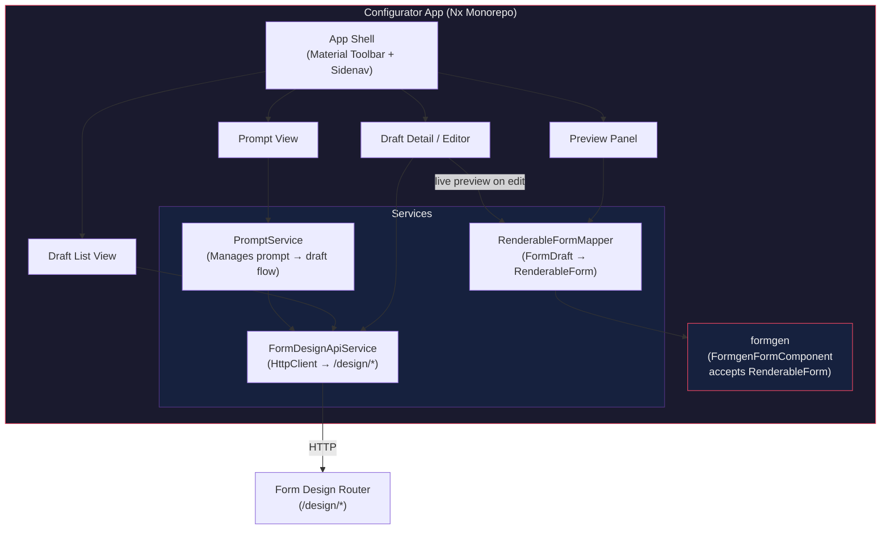
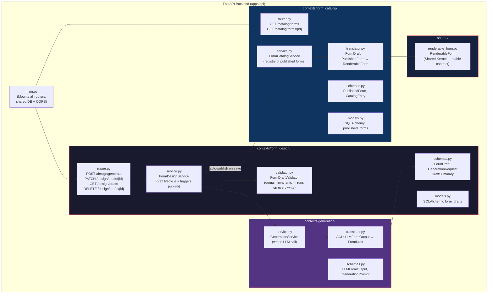
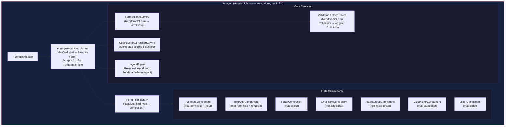
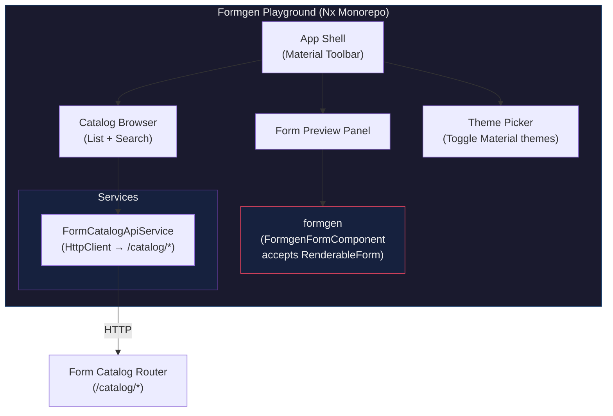

# FormGen POC — Planning Document

> **DDD Note:** This system is organised around four bounded contexts — **Form Design**, **Form Catalog**, **Generation** (supporting), and **Form Rendering**. Each context owns its own models, schemas, and service logic. Context crossings are explicit and translated at the boundary. The shared kernel between backend and frontend is `RenderableForm` — a minimal, stable contract consumed by the formgen library.

---

## 1. Bounded Context Map



---

## 2. System Context Diagram



---

## 3. Component Diagrams

### 3a. Configurator App — Component Diagram

> Talks only to the **Form Design** context. Renders previews using `RenderableForm` — never the raw `FormDraft`.



### 3b. FastAPI Backend — Context Module Structure



### 3c. Formgen Library — Component Diagram

> Consumes **only** `RenderableForm`. Has zero knowledge of `FormDraft`, `LLMFormOutput`, or any upstream context.



### 3d. Formgen Playground — Component Diagram

> Talks only to the **Form Catalog** context. Never calls design or generation endpoints.



---

## 4. Domain Models by Context

### 4a. Generation Context — Raw LLM Output (ACL Input)

This schema is intentionally permissive. It represents what the LLM returns and is never exposed outside the Generation context. The ACL translator maps it to `FormDraft`.

```typescript
// contexts/generation/schemas.py (Pydantic) / LLMFormOutput.ts (type reference)
interface LLMFormOutput {
  name?: string;
  description?: string;
  fields: Array<{
    key: string;
    type: string;           // permissive — validated/coerced in ACL
    label: string;
    placeholder?: string;
    hint?: string;
    required?: boolean;     // LLM shorthand, expanded by ACL
    options?: Array<{ label: string; value: string }>;
  }>;
  layout?: {
    columns?: number;
  };
}
```

### 4b. Form Design Context — FormDraft (Design Aggregate)

Owned entirely by the Form Design context. Includes draft lifecycle metadata not relevant to rendering.

```typescript
// contexts/form_design/schemas.py (Pydantic) / FormDraft.ts (type reference)
interface FormDraft {
  id: string;                   // UUID
  name: string;
  description?: string;
  prompt: string;               // Original prompt that produced this draft
  version: number;
  status: 'draft' | 'saved';
  created_at: string;           // ISO 8601
  updated_at: string;
  fields: FormFieldDraft[];
  layout: FormLayoutDraft;
  actions?: FormActionDraft[];
  css_overrides?: string;
}

interface FormFieldDraft {
  key: string;
  type: FieldType;
  label: string;
  placeholder?: string;
  hint?: string;
  default_value?: any;
  validators?: ValidatorConfig[];
  options?: FieldOption[];
  layout?: { col_span?: number; order?: number };
  conditional?: { field: string; operator: '==' | '!=' | 'in'; value: any };
}

interface FormLayoutDraft {
  columns: 1 | 2 | 3 | 4;
  gap?: string;
  breakpoints?: { sm?: { columns: number }; md?: { columns: number } };
}

interface FormActionDraft {
  type: 'submit' | 'reset' | 'custom';
  label: string;
  color?: 'primary' | 'accent' | 'warn';
}
```

### 4c. Shared Kernel — RenderableForm (Stable Contract)

This is the **only** model the formgen library and frontend rendering code depend on. It is deliberately minimal and stable — changes here are breaking changes to the library contract and should be treated as such.

```typescript
// shared/renderable_form.py (Pydantic) / RenderableForm.ts (Angular)

interface RenderableForm {
  id: string;
  name: string;
  layout: RenderableLayout;
  fields: RenderableField[];
  actions: RenderableAction[];
  css_overrides?: string;
}

interface RenderableLayout {
  columns: 1 | 2 | 3 | 4;
  gap: string;                  // Always resolved — defaults applied upstream
  breakpoints: {
    sm: { columns: number };
    md: { columns: number };
  };
}

interface RenderableField {
  key: string;
  type: FieldType;
  label: string;
  placeholder: string;          // Always a string — empty string if absent
  hint: string;
  default_value?: any;
  validators: ValidatorConfig[];
  options: FieldOption[];
  col_span: number;             // Always resolved — defaults applied upstream
  order: number;
  css_class: string;            // Always generated — never optional
}

interface RenderableAction {
  type: 'submit' | 'reset' | 'custom';
  label: string;
  color: 'primary' | 'accent' | 'warn';
  css_class: string;
}

type FieldType =
  | 'text' | 'email' | 'password' | 'number' | 'tel' | 'url'
  | 'textarea' | 'select' | 'checkbox' | 'radio'
  | 'date' | 'slider' | 'toggle';

interface FieldOption {
  label: string;
  value: string | number;
}

interface ValidatorConfig {
  type: 'required' | 'minLength' | 'maxLength' | 'min' | 'max' | 'pattern' | 'email';
  value?: any;
  message?: string;
}
```

### 4d. Form Catalog Context — PublishedForm

```typescript
// contexts/form_catalog/schemas.py
interface PublishedForm {
  id: string;
  draft_id: string;             // Traceability back to originating draft
  name: string;
  description?: string;
  published_at: string;
  renderable: RenderableForm;   // Pre-translated, ready to serve
}

interface CatalogEntry {        // Lightweight list item for browser
  id: string;
  name: string;
  description?: string;
  published_at: string;
}
```

---

## 5. CSS Selector Generation Strategy

The formgen library generates predictable, scoped CSS selectors so consumers can style forms granularly without fighting encapsulation. Selectors are derived entirely from `RenderableForm` — never from upstream context models.

**Pattern:** `formgen-{formId}-{fieldKey}`

```css
/* Form-level */
.formgen-form--contact-us { }

/* Field-level */
.formgen-field--first-name { }
.formgen-field--first-name .mat-mdc-form-field { }

/* Type-level (for blanket styling by type) */
.formgen-type--text { }
.formgen-type--select { }

/* Action-level */
.formgen-action--submit { }
```

The host app applies these via `::ng-deep` or by setting `ViewEncapsulation.None` on the wrapper component, or by injecting global styles. The generated selectors are deterministic and documented per-config.

---

## 6. Domain Logic Placement

Domain logic is distributed deliberately across three layers, each with a distinct responsibility. Nothing leaks between them.

### Layer 1 — ACL Translator (`generation/translator.py`)
Handles **LLM-specific coercion only**. This layer compensates for the unreliability of external LLM output and is the only place that knows about `LLMFormOutput`. It is not domain logic — it is defensive translation.

Responsibilities:
- Coerce permissive field `type` strings to valid `FieldType` values (default to `text` if unrecognised)
- Expand `required: true` shorthand into a proper `ValidatorConfig` entry
- Clamp `layout.columns` to the valid range of 1–4
- Inject a default submit action if the LLM omitted actions entirely
- Strip unknown keys silently rather than failing

### Layer 2 — Domain Validator (`form_design/validator.py`)
Enforces **domain invariants** on every write operation — both LLM-generated drafts and manual edits from the Configurator. Same validation path regardless of input origin. Returns structured `ValidationError` objects so the router can respond with 422s containing field-level detail.

Invariants enforced for POC:
- Draft must have a non-empty `name`
- All field `key` values must be unique within the draft
- Each field's `col_span` must not exceed the draft's `layout.columns`
- Fields of type `select` or `radio` must have at least one option
- Draft must have at least one action

This validator is a standalone class, not Pydantic model validation, so invariants remain independently testable and can be promoted into an aggregate factory later without untangling.

### Layer 3 — Catalog Translator (`form_catalog/translator.py`)
Handles **default resolution** when a `FormDraft` is promoted to a `RenderableForm`. This is where the `RenderableForm` contract guarantee — no nulls, no optionals on rendering-critical fields — is enforced. Consumers of `RenderableForm` never need to null-check.

Responsibilities:
- Resolve `layout.gap` → default `'16px'` if absent
- Resolve `layout.breakpoints` → sensible column defaults if absent
- Resolve each field's `col_span` → default `1` if absent
- Resolve each field's `order` → positional index if absent
- Resolve `placeholder` and `hint` → empty string `''` if absent
- Generate `css_class` for every field and action (always present on `RenderableForm`)
- Set action `color` → default `'primary'` if absent

---

## 7. Backend File Structure

```
apps/api/
  contexts/
    form_design/
      router.py        # POST /design/generate, PATCH /design/drafts/{id},
                       # GET /design/drafts, DELETE /design/drafts/{id}
      service.py       # FormDesignService — draft lifecycle, runs validator, triggers auto-publish
      validator.py     # FormDraftValidator — standalone domain invariant enforcement
      schemas.py       # FormDraft, FormFieldDraft, GenerationRequest, DraftSummary
      models.py        # SQLAlchemy: form_drafts table
    generation/
      service.py       # GenerationService — wraps LLM API call, returns LLMFormOutput
      schemas.py       # LLMFormOutput, GenerationPrompt
      translator.py    # ACL: coerces LLMFormOutput → FormDraft (defensive, LLM-aware only)
    form_catalog/
      router.py        # GET /catalog/forms, GET /catalog/forms/{id}
      service.py       # FormCatalogService — registry of published forms
      schemas.py       # PublishedForm, CatalogEntry
      models.py        # SQLAlchemy: published_forms table
      translator.py    # Resolves FormDraft → PublishedForm → RenderableForm (fills all defaults)
  shared/
    renderable_form.py # RenderableForm — shared kernel (treat changes as breaking)
    database.py        # Shared SQLAlchemy engine + session factory
    errors.py          # ValidationError, DraftValidationError — shared error types
  main.py              # Mounts routers, CORS, lifespan
  alembic/             # Migrations (one migration covers all context tables)
  .env                 # DATABASE_URL, LLM API keys
```

> **Rule:** No context module imports from another context module directly. `form_design.service` calls `generation.service` via dependency injection. `form_design.service` calls `form_catalog.service` via an injected interface. The only shared import allowed is from `shared/`.

---

## 7. Initial Implementation Plan — POC Milestones

### Phase 0: Project Scaffolding & Decisions
> **Goal:** All three projects exist, build, and serve with placeholder content.

| Step | Task | Key Decision Points |
|------|------|---------------------|
| 0.1 | Create **Configurator** Nx monorepo | Workspace name, package manager (npm/pnpm/yarn), Angular version, Nx preset |
| 0.2 | Generate Angular app inside Configurator workspace | App name, routing strategy, SSR (no for POC), standalone components |
| 0.3 | Add Angular Material + custom theme scaffold | Theme palette choice, typography |
| 0.4 | Create **Formgen Playground** Nx monorepo | Same decisions as 0.1–0.3 |
| 0.5 | Scaffold **formgen** library (Angular CLI, *not* Nx) | Library name/npm scope, ng-packagr config, peer dependency versions |
| 0.6 | Set up **FastAPI** backend inside Configurator monorepo | Python version, venv vs Poetry |
| 0.7 | Stand up **Postgres** locally | Docker vs native install, database name, Alembic |
| 0.8 | Wire all three projects to build and serve | Verify `ng serve` for both apps, `ng build` for library, `uvicorn` for API |

### Phase 1: Shared Kernel — RenderableForm
> **Goal:** Establish the stable contract before building anything that depends on it.

| Step | Task |
|------|------|
| 1.1 | Define `RenderableForm` Pydantic schema in `shared/renderable_form.py` |
| 1.2 | Define `RenderableForm` TypeScript interfaces in the formgen library |
| 1.3 | Implement `FormBuilderService` — takes `RenderableForm`, returns `FormGroup` |
| 1.4 | Implement `ValidatorFactoryService` — maps `ValidatorConfig[]` → Angular `Validators` |
| 1.5 | Build `FormgenFormComponent` — MatCard wrapper, accepts `[config]: RenderableForm` |
| 1.6 | Build field components: `text`, `textarea`, `select`, `checkbox` (4 types for POC) |
| 1.7 | Implement `FormFieldFactory` — dynamic component resolution by `FieldType` |
| 1.8 | Implement `CssSelectorGeneratorService` — generates classes from `RenderableForm` |
| 1.9 | Implement responsive `LayoutEngine` — CSS Grid from `RenderableLayout` |
| 1.10 | Add basic form actions (submit button, value emission via `@Output`) |
| 1.11 | Build & publish library locally (`npm pack` or `npm link`) |

### Phase 2: FastAPI Backend — Context Modules + Persistence
> **Goal:** All four context modules exist with correct boundaries, domain validation, and Postgres persistence.

| Step | Task |
|------|------|
| 2.1 | Scaffold `contexts/` folder structure and `shared/` module |
| 2.2 | Define `RenderableForm` Pydantic schema in `shared/` |
| 2.3 | Define `FormDraft` schemas in `form_design/` |
| 2.4 | Define `LLMFormOutput` schemas and ACL translator in `generation/` (coercion only) |
| 2.5 | Define `PublishedForm` schemas and default-resolving translator in `form_catalog/` |
| 2.6 | Implement `FormDraftValidator` — five core invariants, returns structured errors |
| 2.7 | Set up SQLAlchemy models: `form_drafts`, `published_forms` tables |
| 2.8 | Alembic migration for initial schema |
| 2.9 | Implement `FormDesignService` — stub generation, real CRUD, validator on every write, auto-publish trigger |
| 2.10 | Implement `FormCatalogService` — real CRUD, returns `RenderableForm` on GET by ID |
| 2.11 | Mount all routers in `main.py`, configure CORS |
| 2.12 | Seed script: insert sample `PublishedForm` records directly |

### Phase 3: Generation Context — LLM Integration
> **Goal:** Replace stub generation with real LLM call routed through the ACL.

| Step | Task |
|------|------|
| 3.1 | Implement `GenerationService` — calls LLM API, returns `LLMFormOutput` |
| 3.2 | Implement ACL translator — validates/coerces `LLMFormOutput` → `FormDraft` |
| 3.3 | System prompt engineering — instruct LLM to output valid `LLMFormOutput` JSON |
| 3.4 | Wire `FormDesignService` to call `GenerationService` on `POST /design/generate` |
| 3.5 | Error handling for malformed LLM output (re-prompt or return 422) |

### Phase 4: Configurator App — Prompt-Driven Form Creation
> **Goal:** User types a prompt, gets back a rendered preview, can manually edit and save.

| Step | Task |
|------|------|
| 4.1 | Build `PromptView` — textarea + submit, calls `POST /design/generate` |
| 4.2 | Build `FormDesignApiService` — typed client for `/design/*` endpoints |
| 4.3 | Implement `RenderableFormMapper` service — maps `FormDraft` → `RenderableForm` client-side |
| 4.4 | Build `PreviewPanel` — renders mapped `RenderableForm` via formgen library |
| 4.5 | Build `DraftDetail` editor — form-over-data view of `FormDraft` fields, name, layout |
| 4.6 | Wire `DraftDetail` save to `PATCH /design/drafts/{id}` — preview re-renders on success |
| 4.7 | Surface 422 validation errors from `FormDraftValidator` inline in the editor |
| 4.8 | Iteration flow — modify prompt or edit draft manually, see live preview update |
| 4.9 | `DraftListView` — list drafts with edit/delete |
| 4.10 | Basic error handling and loading states |

### Phase 5: Playground App — Catalog Browse & Render
> **Goal:** Fetch published forms from the catalog context, render via formgen.

| Step | Task |
|------|------|
| 5.1 | Build `FormCatalogApiService` — typed client for `/catalog/*` endpoints |
| 5.2 | Build `CatalogBrowser` — fetches `CatalogEntry[]`, displays list/search |
| 5.3 | Build `FormPreviewPanel` — fetches `RenderableForm` by ID, renders via formgen |
| 5.4 | `ThemePicker` — toggle between 2–3 Material color themes |
| 5.5 | Display generated CSS selectors alongside the rendered form |
| 5.6 | Optional: live CSS override editor (textarea that injects styles) |

---

## 8. Claude Code — Local Setup Plan

> **Workspace assumption:** Claude Code is already running in the project root. All paths are relative to that directory. Nothing is created outside it.

### Block 1: Global Decisions

Before running any commands, Claude Code should confirm the following with the user:

```
Questions for user:
  1. Package manager preference? (npm | pnpm | yarn)
  2. Angular version? (19.x recommended for latest standalone APIs)
  3. Node version? (20.x or 22.x — confirm what's installed: `node -v`)
  4. Python version for FastAPI? (3.11+ recommended — confirm: `python --version`)
  5. Postgres: Docker Compose (recommended) or native install?
  6. What name for the Configurator app? (e.g. configurator)
  7. What name for the Playground app? (e.g. playground)
  8. What npm scope / name for the formgen library? (e.g. @formgen/ui)
```

No commands should be run until all answers are confirmed.

### Block 2: Configurator Nx App

Scaffolded into `apps/configurator/` inside the workspace root.

```bash
npx create-nx-workspace@latest configurator \
  --preset=angular-monorepo \
  --appName=<configurator-app-name> \
  --style=scss \
  --routing=true \
  --packageManager=<chosen-pm> \
  --nxCloud=skip \
  --directory=apps/configurator

cd apps/configurator
npx nx g @angular/material:ng-add --project=<configurator-app-name>
cd ../..
```

### Block 3: Formgen Library

Scaffolded into `libs/formgen/` inside the workspace root. Uses Angular CLI directly, not Nx, so it remains independently publishable.

```bash
mkdir -p libs/formgen && cd libs/formgen
ng new formgen-workspace --create-application=false --package-manager=<chosen-pm>
cd formgen-workspace
ng generate library <formgen-lib-name>
# Add Angular Material as peer dependency in package.json
# Verify ng-packagr is configured in ng-package.json
cd ../../..
```

### Block 4: Playground Nx App

Scaffolded into `apps/playground/` inside the workspace root.

```bash
npx create-nx-workspace@latest playground \
  --preset=angular-monorepo \
  --appName=<playground-app-name> \
  --style=scss \
  --routing=true \
  --packageManager=<chosen-pm> \
  --nxCloud=skip \
  --directory=apps/playground

cd apps/playground
npx nx g @angular/material:ng-add --project=<playground-app-name>
# Link formgen library via file: reference in package.json
# e.g. "<formgen-lib-name>": "file:../../libs/formgen/formgen-workspace/dist/<formgen-lib-name>"
cd ../..
```

### Block 5: FastAPI Backend

Scaffolded into `apps/api/` inside the workspace root.

```bash
mkdir -p apps/api && cd apps/api

python -m venv .venv
source .venv/bin/activate  # Windows: .venv\Scripts\activate

pip install fastapi uvicorn sqlalchemy asyncpg alembic pydantic python-dotenv

# Scaffold context structure
mkdir -p contexts/form_design contexts/generation contexts/form_catalog shared

# Files to create:
#   main.py
#   shared/database.py
#   shared/renderable_form.py
#   shared/errors.py
#   contexts/form_design/router.py, service.py, validator.py, schemas.py, models.py
#   contexts/generation/service.py, schemas.py, translator.py
#   contexts/form_catalog/router.py, service.py, schemas.py, models.py, translator.py
#   .env  (DATABASE_URL, LLM API key)

alembic init alembic
cd ../..
```

### Block 6: PostgreSQL

`docker-compose.yml` placed at the workspace root so it's accessible from anywhere.

```bash
cat > docker-compose.yml << 'EOF'
services:
  postgres:
    image: postgres:16
    environment:
      POSTGRES_DB: <db-name>
      POSTGRES_USER: <db-user>
      POSTGRES_PASSWORD: <db-password>
    ports:
      - "5432:5432"
    volumes:
      - pgdata:/var/lib/postgresql/data

volumes:
  pgdata:
EOF

docker compose up -d

# Run migrations
cd apps/api
source .venv/bin/activate
alembic upgrade head
cd ../..
```

### Block 7: Verification & Smoke Test

At the end of Phase 0, the following should all pass before moving to Phase 1.

```bash
# Confirm workspace structure looks correct
ls apps/        # → api/  configurator/  playground/
ls libs/        # → formgen/

# FastAPI
cd apps/api && source .venv/bin/activate
uvicorn main:app --reload --port 8000
# → http://localhost:8000/docs should show Swagger UI

# Configurator
cd apps/configurator
npx nx serve <configurator-app-name>
# → http://localhost:4200 should render Angular shell

# Playground
cd apps/playground
npx nx serve <playground-app-name> --port 4201
# → http://localhost:4201 should render Angular shell

# Formgen library
cd libs/formgen/formgen-workspace
ng build <formgen-lib-name>
# → dist/ folder should be produced with no errors
```

### Resulting Workspace Structure

```
<workspace-root>/
  apps/
    configurator/     # Nx monorepo — Configurator Angular app
    playground/       # Nx monorepo — Formgen Playground Angular app
    api/              # FastAPI backend — context modules
      contexts/
        form_design/
        generation/
        form_catalog/
      shared/
      main.py
      alembic/
      .env
  libs/
    formgen/          # Standalone Angular library (ng-packagr)
      formgen-workspace/
  docker-compose.yml  # Postgres
```

---

## 9. Key Technical Decisions Summary

| Decision | Recommendation | Rationale |
|----------|---------------|-----------|
| **Bounded contexts** | Form Design, Form Catalog, Generation (supporting), Form Rendering | Clean DDD separation; each context owns its model and lifecycle |
| **Shared kernel** | `RenderableForm` only | Minimal stable contract between backend and formgen; treat changes as breaking |
| **Auto-publish on save** | `FormDesignService` triggers `FormCatalogService` internally | Clean context boundary without publish UI overhead in POC |
| **Generation as internal context** | No public router; called only by Form Design service | Keeps LLM details encapsulated; swap provider without touching other contexts |
| **ACL responsibility** | Coercion only — normalise LLM output shape, fill structural gaps | ACL compensates for LLM unreliability; domain invariants belong in the validator, not here |
| **Domain validator** | Standalone `FormDraftValidator` in `form_design/validator.py` | Decoupled from serialisation; independently testable; promotable to aggregate factory later |
| **Validator runs on every write** | Both LLM-generated and manually edited drafts pass through the same validator | Invariants are input-source-agnostic; one enforcement path, no gaps |
| **Default resolution** | Catalog translator resolves all optionals before producing `RenderableForm` | Rendering contract guarantee — consumers never null-check; defaults owned in one place |
| **Manual editing in Configurator** | `DraftDetail` editor for form-over-data editing of `FormDraft` | Primary feedback loop for tuning LLM output; extensible to WYSIWYG later |
| **ACL for LLM output** | `generation/translator.py` maps `LLMFormOutput` → `FormDraft` | Protects domain model from malformed or evolving LLM output shape |
| **Client-side mapper** | `RenderableFormMapper` in Configurator app | Keeps formgen library ignorant of `FormDraft`; preview uses same contract as Playground |
| **State management** | Signals + services (no NgRx for POC) | Keep it simple; add state management later if needed |
| **Component style** | Standalone components | Modern Angular best practice, tree-shakeable |
| **LLM for POC** | Claude Haiku via API or Ollama local | Low cost, fast, good at structured JSON output |
| **Formgen distribution** | `npm link` for local dev | Avoids publishing; switch to Verdaccio or npm later |
| **DB schema** | Two tables (`form_drafts`, `published_forms`), JSONB for config payload | Context-separated storage; flexible for iteration |
| **Inter-context calls** | Dependency injection within single FastAPI process | Same-process for POC; extractable to separate services later |
| **API auth** | None for POC | Add API keys or JWT later |
| **Testing** | Minimal — `FormDraftValidator` unit tested; Jasmine/Karma defaults for Angular | Validator is highest-value test target; add Cypress/Playwright e2e in a later phase |

---

## 10. What's Explicitly Out of Scope for POC

- Authentication / authorization
- CI/CD pipelines (scaffolding only)
- Form config versioning / diff history
- Multi-user collaboration
- Drag-and-drop form builder UI
- Advanced field types (file upload, rich text, repeating groups)
- Conditional logic rendering (defined in spec, implemented later)
- Server-side rendering
- Production deployment
- Message bus / domain events between contexts (sync calls used for POC)
